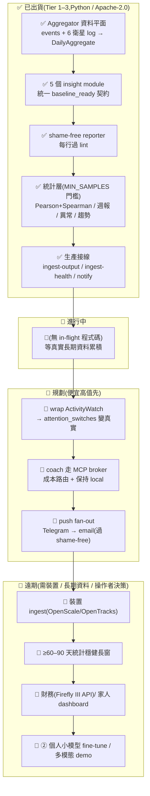

> ARCHIVED 2026-06-19 — 內容已併入 docs/phantom-companion.md;此為歷史版本。

# 路線圖(繁體中文視覺版)— phantom-companion

_最後更新 2026-06-19。英文 SSOT:[`ROADMAP.md`](ROADMAP.md)(狀態以英文版為準);_
_OSS 選型依據:[`docs/OSS-LANDSCAPE-AND-DIRECTION.md`](docs/OSS-LANDSCAPE-AND-DIRECTION.md)。_

> ⚠️ **本檔為視覺導覽,不是狀態 SSOT。** 任何「已出貨/進行中」的權威以英文
> [`ROADMAP.md`](ROADMAP.md) 為準。本檔幫你快速掃完整體方向與排序邏輯。

---

## ① 定位 + 護城河

**一句話定位(依 README / 設計 spec):** phantom-mesh 上、**「跨裝置 + 自動 +
LLM-insight + shame-free」**的個人改善迴圈,spec 自我定位為此組合中的先行者
—— 不是等你問才答,而是看你怎麼活(LLM 用量、commit、RSS 閱讀、
行事曆、健康、求職 lead),跨整個 phantom-mesh 找 pattern,寫日 / 週 / 月 / 季報,
語言**結構上保證不羞辱**。

**🛡️ 護城河(別人抄不走的):**

- **跨衛星相關性** —— 在本次調查的 OSS 競品中,沒有一個同時看 *LLM 成本 × 健康
  × 學習 × 求職*(見 OSS 調查):ActivityWatch 只看活動、Rize 只看 focus、
  Exist.io 只在雲端、Bearable 只手動記。
- **Local-first / shame-free 是硬約束** —— 不是行銷詞。`reporter.py` 的 shame-free
  lint 對每一行強制生效;off-device relay 一律 opt-in + consent-gated + 去 PII。
- **keystone 角色** —— 是七專案中唯一消費其他六個輸出的專案,demo 敘事最強。

**🚨 誠實前提(by design,不是 bug):** 引擎已建好且測過,但**有用的 insight 需要
~30+ 天累積的 phantom-mesh 事件** + {③ ai-feed / ⑥ flow} 至少一個有真實寫入節奏。
今天跑,報告**結構正確但訊號稀薄**,會誠實退化成「正在收集 baseline」的 stub,
而不是硬掰 insight。**→ 真正的瓶頸是資料量與真實裝置/衛星 ingest,不是缺功能。**

---

## ② Mermaid 狀態流(✅ 已出貨 → 🚧 進行中 → 📅 規劃 → 🔭 遠期)

---

## ③ 分期表

> 排序邏輯(依單人多機開發模型):**便宜高值先 → 護城河先 → 需長期資料/裝置/操作者
> 決策的後排。** 機台:z13 / M5 / M1 / acer / ayaneo / Android。寫碼=codex 或 claude;
> 審查 ≥2 個不同 AI(distinct)+ governor + 雙閘 → 手機核准。OSS 選型只標「候選方向」。

| 階段 | 目標 | 具體項(2–4) | 在哪台機 | 哪 AI(寫/審) | 風險前置 |
|---|---|---|---|---|---|
| **P0 ✅ 已完成** | 引擎落地 | ① 資料平面 ② 5 module ③ shame-free reporter ④ 統計層+接線 | 已完成(master grounded) | 已完成 | 無 —— 已測過 |
| **P1 📅 讓資料累積(零碼)** | 把「30+ 天」前提變成真資料 | ① 每日跑 mesh 累積事件 ② 真資料(非 fixture)上跑 demo ③ 確認 ③/⑥ 至少一個有寫入 | 任意常駐機(z13/ayaneo serve) | **無需寫碼**,操作者執行 | 最低風險;唯一風險=忘記跑 → 永遠 stub |
| **P2 📅 wrap ActivityWatch(最高槓桿)** | attention 模組從 stub→真實 | ① 讀 AW local export(SQLite/REST)② 映射成 normalized records ③ 餵進 `attention_switches`(不自建 watcher) | z13 | 寫=codex(單檔);審=opencode+agy;雙閘→手機 | **別重造 AW**(17.9k★ 多年工程);只 wrap。隱私:AW 本地優先,繼承同一 gate |
| **P3 📅 coach 路由 + push fan-out** | LLM insight 保 local + 成本路由 | ① `_invoke_coach` 改走 MCP broker ② Gemini Flash 壓縮 / Claude 收尾 ③ Telegram→email(過 shame-free) | M1 / M5 | 寫=codex/claude;審 ≥2 distinct AI;governor 控外送 | 外送=新攻擊面 → relay 一律 opt-in/consent/去 PII;每行仍過 lint |
| **P4 🔭 裝置 ingest(條件式)** | 真健康指標翻 gate | ① OpenScale/OpenTracks export → ④ ingest ② 翻「Waiting on: health」為真值 | acer / ayaneo + Android 端裝置 | 寫=codex;審 ≥2 distinct AI | **僅在真有裝置每日使用才做**;否則=純 over-build,跳過 |
| **P5 🔭 遠期(操作者決策後)** | 擴張面向 | ① 財務(Firefly III API,**不 vendor**)② 家人 dashboard ③ ② 個人小模型 ④ 多模態 demo | 待定 | 待定;需操作者決策 + ≥60–90 天資料 | 太早做=fake-green;AGPL/重量級只走 API |

---

## ④ 刻意不做 / Over-build 警戒表

| ❌ 不做 / 警戒 | 為什麼 |
|---|---|
| ❌ **臨床診斷** | BIG-GOAL 明確 ruled out |
| ❌ **監視式 surveillance** | 違反 consent-gating(隱私即產品) |
| ❌ **Shame-based 介面**(「你又熬夜了」) | 硬約束;換成「比昨天的選擇好/差在哪」。新 LLM 路徑也必過 lint |
| ⚠️ **真資料 < 30 天前就加新 insight module** | 引擎已超出現有資料量 → 產出無法驗證的 fake-green。**現有 gate 被真資料壓力測試前,克制新分析碼** |
| ⚠️ **重造 ActivityWatch / 自寫跨平台 watcher** | 多年工程、17.9k★ 已解;單人重造=經典陷阱。**只 wrap** |
| ⚠️ **vendor Firefly III(PHP/AGPL)或 Obsidian 核心** | 重量級 / 授權不相容;最多走 API,絕不內嵌 |
| ⚠️ **沒裝置就先寫裝置 ingest** | 為不存在的資料寫管線=純浪費。條件式,有裝置才做 |
| ⚠️ **off-device relay 預設開啟** | 預設 local sink;relay 必 opt-in + consent + 去 PII(`notify.py` 已如此) |

---

> 候選 OSS 方向(只標方向,不綁定):**wrap** ActivityWatch(attention)、
> **reference** QS Ledger(connector 廣度)+ Exist.io(相關性清單)、
> **條件式 wrap** OpenScale/OpenTracks(健康)、**僅 API** Firefly III(財務)。
> 細節見 [`docs/OSS-LANDSCAPE-AND-DIRECTION.md`](docs/OSS-LANDSCAPE-AND-DIRECTION.md)。
