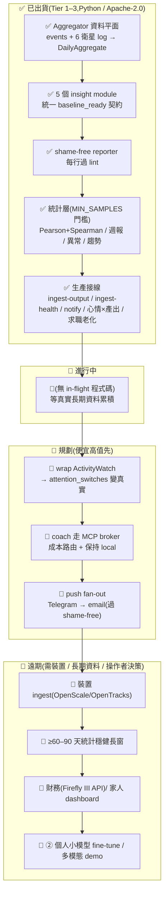

# phantom-companion — 唯一主文件

> 本檔為 phantom-companion 唯一主文件;舊版見 `docs/_archive/`。
> 對應狀態:目前工作樹 — Tier 1–3 引擎落地(Python / Apache-2.0)、131 passing tests、CLI 子指令 `daily-report` / `weekly-report` / `trends` / `checkin` / `ingest-output` / `ingest-health` / `anomaly-alerts`。每個「已出貨」項都對應 `master` 上的真實 commit。

## 目錄
- [這是什麼(一句話 + 為誰)](#這是什麼一句話--為誰)
- [它怎麼幫你(具體例子)](#它怎麼幫你具體例子)
- [方向與願景(deep-thought、extended — 人生財富框架)](#方向與願景deep-thoughtextended--人生財富框架)
- [快速上手](#快速上手)
- [狀態與視覺路線圖](#狀態與視覺路線圖)
- [開源生態與方向](#開源生態與方向)
- [刻意不做 / over-build 風險](#刻意不做--over-build-風險)

---

## 這是什麼(一句話 + 為誰)

**一句話:phantom-companion 是你的「每日複盤大腦」—— 它不等你問,而是默默看你怎麼過日子(用了多少 AI、寫了幾個 commit、訂的東西讀了沒、睡了幾小時、求職投了幾家),跨整個 phantom-mesh 找出規律,寫成日報 / 週報 / 月報,幫你下一個更好的決定 —— 而且講話永遠不羞辱你。**

換個比喻:市面上的工具各看一塊 —— RescueTime 只看你開了哪些 app、Rize 只看你專不專心、Apple 螢幕使用時間只在 iPhone 上、Bearable 還要你自己手動記。phantom-companion 想做的是把這些**全部串起來**,而且是在**你自己的電腦上**跑、**自動**收集、用 **AI 看出意義**、再用**不會讓你有罪惡感**的方式講給你聽。

**為誰做的:** 一個人(就是你),想要長期把自己過得更好 —— 更有精神、更少浪費時間、做更好的選擇 —— 但又不想把健康、財務、行為這些最私密的資料交給雲端公司。

**它在 phantom-mesh 生態系裡的角色(keystone,基石):**
phantom-mesh 一共有七個專案。其他六個各做一件事(財務、AI 資訊流、安全連線健康、求職、訓練、量化分析),只有 phantom-companion **消費它們全部的輸出**,把一堆零散的數字變成「你這個人這週過得怎樣」。所以它是把 phantom-mesh **從工程師的工具箱,變成每天都會用的生活產品**的那一塊。

它用 Python 寫、Apache-2.0 授權、附一個命令列工具(`daily-report` / `weekly-report` / `trends` / `checkin` / `ingest-output` / `ingest-health` / `anomaly-alerts`)。

**🛡️ 護城河(別人很難抄走的三件事):**

- **跨衛星相關性** —— 在這次調查的開源競品裡,沒有任何一個同時看「*AI 花費 × 健康 × 學習 × 求職*」。ActivityWatch 只看你在用什麼 app、Rize 只看專注度、Exist.io 只在雲端、Bearable 只能手動記。把這四塊放在同一個迴圈裡關聯,是它獨有的。
- **Local-first(資料留在本機)+ shame-free(不羞辱)是硬性規定,不是行銷詞** —— 程式裡的 `reporter.py` 有一個 shame-free lint(檢查器,對應 phantom-mesh 的 `coach_prompts/lint.rs`),報告的**每一行**都得通過它;任何要送出裝置的資料,一律要你**主動同意**、先去掉個資。
- **keystone 角色** —— 唯一消費其他六個衛星輸出的專案,demo 故事最完整、最難複製。

**它服務的 pillar(phantom-mesh 的支柱):** **P3**(進化網 —— 找規律是 Hermes 6 步流程的自然延伸)、**P4**(加密為先 —— 所有個人行為資料只留本機,不上雲)、**P1**(跨平台 —— 行為資料來自 Mac / Win / Linux / iOS / Android)。

**🚨 一個誠實的前提(這是設計,不是 bug):**
引擎已經建好、也測過了,但**真正有用的洞察需要累積大約 30 天以上的 phantom-mesh 事件**,而且 {③ ai-feed digest log、⑥ flow 求職 log} 至少要有一個在真實寫入。今天就跑,報告**結構是對的、但訊號很稀薄**,它會誠實地退化成「正在收集 baseline(基準線)」的占位內容,而**不會硬掰一個假洞察**。**→ 所以真正的瓶頸是資料量、是真實的裝置 / 衛星寫入,不是缺功能。**

**招聘對齊角度:** Garmin / 穿戴裝置團隊(多來源健康 × 行為關聯 + 裝置端隱私)、Anthropic / LLM-tooling 團隊(主動式 agent、裝置端隱私、成本感知路由,對齊 Claude Memory / Claude Code 的演進)、Micron AIoT / 數位治療(shame-free coaching 是硬約束、長期個人資料但不被雲端綁架)。

---

## 它怎麼幫你(具體例子)

最快理解它的方式,是看它實際會講什麼。下面都是它**設計上要產出**的那種洞察(訊號要等資料累積才會這麼飽滿 —— 見上面的誠實前提):

**例子一 —— 睡眠 × 產出:**
> 「我發現一個規律:你睡不到 6 小時的隔天,commit 數量平均掉 30%。不是要你早睡(這是你的事),只是讓你知道這個連動 —— 如果明天有重要的東西要寫,今晚多睡一點可能划算。」

它不會說「你又熬夜了」,而是把「選擇」跟「結果」攤在你面前,讓你自己決定。

**例子二 —— 週六晚上的複盤:**
> 本週複盤:
> ✓ 求職投了 5 家,3 家有回、1 家進到 onsite
> ⚠ 你訂的 15 個 AI 資訊來源,這週只真的讀了 3 個(LangChain blog / r/LocalLLaMA / Karpathy),其他 12 個可以考慮砍掉,省下注意力
> ⚠ 這個月的 LLM 花費已經用掉預算的 70%,還剩 9 天 —— 把 refactor 這類任務改用 Gemini Flash 大概可以省 60%
> ✓ 平均睡眠 6.8 小時(離你的目標 7 小時差一點點)

**例子三 —— 求職 lead 老化提醒:**
> 「有 3 家公司你投了超過 7 天還沒收到回覆,也還沒做 follow-up。最久的那家是 12 天前 —— 要不要寄一封簡短的跟進信?」(它幫你排序,最舊的排前面,語氣是「值得提一下」,不是「你怎麼又忘了」。)

**例子四 —— 心情 × 產出:**
> 「過去兩週,你自評心情 4 分以上的那幾天,平均 commit 數明顯比心情 2–3 分的日子高。心情不是用來逼你的,只是個提醒:狀態好的時候,你的產出確實會跟上。」

這些例子的共同點:**資料是自動收集的、洞察是跨領域的、語氣是不羞辱的、所有運算都在你自己的機器上**。

---

## 方向與願景(deep-thought、extended — 人生財富框架)

> ⚠️ **本節是「方向 / 願景」,不是「已出貨」。** 下面講的目標函數、主動推播、複盤儀式、閉環,大多是**今天的引擎還沒做到**的延伸方向。已經出貨的東西看下一節〈狀態與視覺路線圖〉,以真實 commit 為準。誠實的「需要 30 天以上資料」前提,在願景裡一樣成立 —— 願景不會讓引擎一夜變強,只是說明它該往哪走。

### 它到底是什麼?一句話讓它「click」

phantom-companion 的本質,是你的**個人生活作業系統(Life OS)**裡那個負責「複盤與決策」的大腦。

姊妹專案 phantom-tutor 把自己升級成「**人生財富最大化的求職 copilot**」—— 它最佳化的是你的**職涯財富**(下一份工作對你 3–5 年的複利好不好)。phantom-companion 是它的對照:它最佳化的是你的**人生財富**(life wealth)—— 你每一天的精神、時間、能量、心情、人際、產出,過得有沒有比昨天好一點。

**讓它 click 的那句話:** *別的工具告訴你「你做了什麼」(raw data);phantom-companion 告訴你「這對你這個人好不好,以及下一步可以怎麼小小調整」(decision)。*

### 它做、而別人不做的那一件事

Exist.io、Rize、ActivityWatch、Apple 健康,各自都很強,但都缺其中一塊:

- **ActivityWatch** 給你超完整的活動紀錄 —— 但只到 raw data,不告訴你意義。
- **Rize** 給你 AI 解讀的專注力 —— 但只看專注力一塊,而且只在雲端。
- **Exist.io** 真的會把人生關聯起來(心情 × 步數 × 天氣)—— 但**只在雲端**,你的資料是它的。
- **Apple 健康** 整合得很好 —— 但只在 Apple 裝置上,而且不碰你的 commit、AI 花費、求職。

phantom-companion 站的那個獨一無二的位置 = **「跨領域關聯」+「AI 解讀」+「本機運算」+「不羞辱」同時成立**。為什麼這個組合是 unlock(關鍵解鎖)?

- **本機(local-first)是前提**,不是加分項。因為要做有用的人生關聯,你得餵進**最私密的資料** —— 睡眠、心情、財務、健康、求職。只有「資料不離開你的機器」,人才敢餵這些。雲端工具做不到這層信任,所以它們永遠只能看你願意給的那一小塊。
- **跨衛星(cross-satellite)是深度**。單看睡眠、單看 commit,都只是數字;把它們**關聯**起來,才會出現「睡不到 6 小時 → 隔天產出掉 30%」這種**只屬於你**的洞察。
- **shame-free(不羞辱)是它能長期被用下去的原因**。會羞辱人的工具,你用兩週就刪了。能陪你跑一年的,只有那個讓你**沒有罪惡感**地面對自己的工具。長期複利,前提是你願意一直回來看。

### 人生財富目標函數(life-wealth objective function)

phantom-tutor 用「四軸職涯財富」排序工作;phantom-companion 用一個對應的、簡單的「人生財富」模型,來判斷「過得更好」到底是什麼意思。「過得更好」不是單一個分數,而是同時看幾個軸 —— 每個軸都已經、或可以由 mesh 的資料餵進來:

| 軸 | 問的問題 | 由哪些 mesh 資料餵 |
|---|---|---|
| **能量(Energy)** | 我今天 / 這週有沒有體力跟精神? | 睡眠時數、HRV、resting-HR、活動量(④ secure-connector 健康)+ 主觀 gut/mood check-in |
| **時間(Time)** | 我的時間花在刀口上,還是漏掉了? | 注意力切換次數(未來 wrap ActivityWatch)、AI 使用、commit 時段分佈 |
| **選擇品質(Choice quality)** | 我有沒有做出對自己好的小選擇? | 把「選擇」(睡早一點 / 砍掉沒讀的 source / 跟進求職)跟「結果」配對的關聯 |
| **心情 × 產出(Mood × output)** | 我的狀態跟我的產出怎麼連動? | nightly mood check-in × daily commit output 的門檻關聯(已出貨) |
| **人際 / 投入(Relationships / 黏著)** | 我有沒有照顧到長期重要的關係與承諾? | 家人健康追蹤(遠期)、長期承諾的 compliance(願景) |

**這個目標函數的重點不在「算出一個分數」,而在「給你一個共同的尺,讓跨領域的東西可以被一起權衡」。** 就像 phantom-tutor 用 wealth-score 把「872 個職缺」排成「最該投的前 N 個」,phantom-companion 用人生財富這把尺,把「一堆零散的數字」變成「這週最值得調整的那一件小事」。

而且要誠實:這個模型的第一版**應該很薄** —— 就是「幾個軸 + 簡單關聯」,先用真實資料證明它有用,再談更細的加權或 LLM 細化。過早把它工程化,只會做出無法驗證的 fake-green(假的綠燈)。

### 願景往哪走(超出今天引擎的延伸)

今天的引擎會「產出報告」;願景是讓它從「會寫報告」進化成「會陪你變好」。順序如下(便宜高值的先做):

1. **主動推播(proactive nudges)。** 今天你要主動跑 `daily-report` 才看得到;願景是它在對的時間(早上的晨報、晚上的複盤)**主動**、溫和地提醒你一件最值得注意的事 —— 走 governor + 手機核准,絕不變成轟炸。
2. **每日 / 每週的「複盤」儀式。** 把報告變成一個**固定的小儀式**:每晚一行 check-in(已出貨)+ 每週六晚上一次回顧。儀式感是長期複利的關鍵 —— 它讓「看自己的資料」變成習慣,而不是偶爾為之。
3. **閉環(close the loop)。** 這是願景的核心,也是今天最缺的一塊:
   `發現一個規律 → 建議一個「小到不可能失敗」的調整 → 隔週回頭看「那個調整有沒有幫到你」`。
   例如:「上週你試著在睡前一小時不寫 code,結果這週平均多睡了 0.5 小時、隔天 commit 也回升了 —— 看來這個小改變對你有用,要不要繼續?」**只有閉環,companion 才從「儀表板」變成「教練」。**
4. **接上 apex-② owned-memory(越用越懂你)。** 今天的 baseline 是統計門檻;願景是把這些長期的個人規律,沉澱進 phantom 的 owned-memory(加密、跨裝置、廠商看不到)。用得越久,它越知道「對你而言,睡 6.5 小時就夠 / 7 小時才夠」這種**只屬於你**的校準。這是 apex-② 的護城河介面。
5. **接上 apex-④ governed-unattended(受治理的無人值守)。** 任何**對外動作**(送出推播、寄跟進信、把報告 relay 到手機),一律走 PreToolUse gate → 手機核准才執行。這是把「主動 + 自動」做得**合規、可信**的唯一正確方式 —— 主動不等於失控。

**一句話收束願景:** phantom-tutor 幫你拿下那份「人生財富最大化」的工作;phantom-companion 幫你把拿到工作之後(以及之前)的**每一天**,過得更有能量、更少浪費、選擇更好 —— 用得越久越懂你,而且資料永遠是你的。

---

## 快速上手

```bash
git clone https://github.com/markl-a/phantom-companion
cd phantom-companion
pip install -e .

# 跑日報(會吃 ~/.phantom-mesh/events/ + 各 satellite log)
python -m phantom_companion.cli daily-report

# 週報(cross-satellite pattern rollup:LLM / 注意力 / 學習 ROI / 求職,含過期求職 lead)
python -m phantom_companion.cli weekly-report

# 月報 / 季報(long-window trend,direction-only,density-gated;含 心情 × 產出 跨領域相關性)
python -m phantom_companion.cli trends --period monthly
python -m phantom_companion.cli trends --period quarterly

# 每晚 1 行主觀紀錄(gut 1-5 / mood 1-5 / sleep hr,local-only JSONL)
python -m phantom_companion.cli checkin "2026-05-22 gut=4 mood=3 sleep=7.2"

# 把真實 git 活動寫成 output-{day}.json(餵 健康 × 產出 相關性)
python -m phantom_companion.cli ingest-output

# 把 ④ secure-connector 健康匯出寫成 health-{day}.json
python -m phantom_companion.cli ingest-health <export>

pytest -v
```

報告寫到:

```
~/.phantom-mesh/logs/phantom-companion/<date>-report.md
```

### Architecture(在 phantom-mesh 生態系內)

phantom-companion 是 keystone —— 唯一消費其他 6 個 satellite 輸出的專案。下圖是資料怎麼從六個衛星流進來,經過聚合、洞察、shame-free 把關,最後變成一份報告:

```
~/.phantom-mesh/events/        <- E002 event capture(透過 phantom recall 解密,非 raw events/ dir)
~/.phantom-mesh/logs/
  phantom-ai-feed/             <- ③ digest + answered questions
  phantom-flow/                <- ⑥ jobseek triggers
  phantom-training/            <- ② training runs
  phantom-secure-connector/    <- ④ redaction / anomaly / health events
  phantom-enterprise/          <- ⑤ corp connector events
  phantom-*-heartbeat.log      <- satellite liveness
                          │
                          ▼
              phantom_companion.aggregator   → 型別化 DailyAggregate(純 Python,無 LLM,無網路)
                          │
                          ▼
       5 insight_modules/*(llm_usage / attention_switches / health_productivity_correlation
                           / learning_roi / jobseek_followup;統一 baseline_ready 契約)
                          │
                          ▼
                 reporter(shame-free lint;LLM coach 潤飾失敗則 deterministic 樣板勝出)
                          │
                          ▼
   ~/.phantom-mesh/logs/phantom-companion/<date>-report.md
```

### 30 秒 demo

[`docs/demo.cast`](demo.cast) —— `phantom_companion.cli daily-report` 跑全部 5 個 insight module 的 asciinema 錄製(今天多為 baseline;訊號隨每日使用累積)。刻意 self-hosted —— 不上傳 asciinema.org、無第三方追蹤。

```sh
asciinema play docs/demo.cast
# 或無工具直接看文字:
cat docs/demo.cast | jq -r '.[] | select(.[1]=="o") | .[2]'
```

### 何時開始有價值

累積 **30+ 天 phantom-mesh 事件** 之後,且 {③ ai-feed digest log、⑥ flow jobseek log} 至少一個有實際寫入。在那之前,insight 是 stub-shaped(占位形狀)但結構正確 —— 它老實地說「正在收集 baseline」,不硬掰。

---

## 狀態與視覺路線圖

> 排序邏輯(依單人多機開發模型):**便宜高值先 → 護城河先 → 需長期資料 / 裝置 / 操作者決策的後排。** 每個「已出貨」項對應 `master` 上的真實 commit。OSS 選型只標「候選方向」(見下方〈開源生態與方向〉),非已鎖定承諾。

### 狀態總覽(Mermaid)



### ✅ 已出貨(grounded,對應真實 commit)

**Tier 1 —— 資料平面 + 報告基礎**

| 項目 | 具體內容 | 證據 |
|---|---|---|
| Aggregator 資料平面 | `aggregator.py` 讀 `~/.phantom-mesh/events/`(透過 `phantom recall` 解密)+ 6 個 satellite log/heartbeat → 型別化 `DailyAggregate`;純 Python、無 LLM、無網路 | Tier 1 |
| 5 個 insight module | `llm_usage` / `attention_switches` / `health_productivity_correlation` / `learning_roi` / `jobseek_followup`;統一 `{module, summary, details, baseline_ready}` 契約 + 誠實 baseline-stub fallback | Tier 1 |
| shame-free reporter | `reporter.py` 組日 / 週 markdown;每行過 shame-free lint(對應 `coach_prompts/lint.rs`);coach 潤飾失敗則 deterministic 樣板勝出 | Tier 1 |
| Real LLM coach pass | `phantom coach review` 接線修好(utf-8 decode),coach block 併入報告 + next-step 行 | Tier 1 |
| CLI + 封裝衛生 | `daily-report` / `weekly-report`;Apache-2.0 LICENSE、CI workflow + badge、`docs/demo.cast`、`.env`/`agents.toml`/`.venv*` gitignored | Tier 1 |

**Tier 2 / Tier 3 —— 統計層(全在單一來源 `MIN_SAMPLES` ≈ 14 天密度門檻之後)**

| 項目 | 具體內容 | 對應 commit |
|---|---|---|
| Foundation | deterministic mock-mesh fixtures + 單一來源 `MIN_SAMPLES` gate;型別化 `AggregateWindow` + normalized records + SQLite window cache | Tier 2/3 基座 |
| P1-M3 健康 × 產出相關性 | 真 ④ secure-connector 健康(sleep / HRV / resting-HR / activity / source)+ git output → gated Pearson **與** Spearman,嚴格 no-causation 措辭;門檻下退化為 direction-only | `98f55ba` `e6a6a14` |
| P2-M1 週報 cross-satellite rollup | LLM usage / attention / learning ROI / jobseek,off 型別化 `AggregateWindow` + SQLite cache | P2-M1 |
| P2-M2 density-gated 異常警示 | rolling-MAD over health / LLM-cost / attention;短噪窗不警示;alerts shame-free(per-point density floor + local floor + kind allowlist 加固) | `606d136` `469c970` `e47b1eb` `660a3f3` `708451c` |
| P3-M1 notification delivery | local-first sink always;off-device relay opt-in + consent-gated + payload-minimised;`deliver()` 接進真實 daily / weekly / anomaly 報告路徑(先前從未被呼叫)+ reachable anomaly-alerts CLI | `ea55678` `517eecc` |
| P3-M2 主觀趨勢 | nightly subjective `checkin` + monthly / quarterly `trends`;shame-free lint 對英文加固 | `606d136` `469c970` |

**生產接線(把 claimed-but-unreachable green 變 real green)**

| 項目 | 具體內容 | 對應 commit |
|---|---|---|
| Output writer | `ingest-output` 從真 `git log` 活動寫 `output-{day}.json` 到 reader/aggregator 消費的確切路徑;健康 × 產出相關性吃到真資料而非永久 baseline-empty | `4f73af8` `1c1eb13` |
| Health ingest | `ingest-health <export>` 重用 `parse_secure_connector_export` + `write_health_samples` 寫 `health-<day>.json`;翻「Waiting on: health」為真值(真 decryption / iOS / Garmin / Relay 路徑仍 env-blocked) | `f2c45ee` `d5780f8` |
| 心情 × 產出 跨領域相關性 | `correlate_subjective_output` 把 nightly check-in mood 與 daily commit output 經 `_pearson_r`/`_spearman_r` + `MIN_SAMPLES` gate 配對;trends 報告渲染 Mood × output 段。spec keystone「跨領域相關性(心情)」 | `ca1332f` `73447d7` |
| 過期求職 lead(老化) | weekly rollup 算 still-pending(never applied)lead 的 `days_open`,emit ranked stale-leads(≥7 天,oldest first),渲染 shame-free「Worth a nudge」行 | `b860bd9` `3411f7a` |

> 目前:**131 passing tests**、上述 CLI 子指令。原始碼已驗對得上(`aggregator.py` / `reporter.py` / `notify.py` / insight_modules / driver 皆在;真 device/decryption ingest 仍 env-blocked)。

### 🚧 進行中

無 in-flight 程式碼。已出貨的引擎在等真實長期資料量(見上方誠實前提),不是缺更多碼才有用。

### 📅 規劃 / 分期表

> 機台:z13 / M5 / M1 / acer / ayaneo / Android。寫碼=codex 或 claude;審查 ≥2 個不同 AI(distinct)+ governor + 雙閘 → 手機核准。

| 階段 | 目標 | 具體項 | 在哪台機 | 哪 AI(寫/審) | 風險前置 |
|---|---|---|---|---|---|
| **P1 📅 讓資料累積(零碼)** | 把「30+ 天」前提變真資料 | 每日跑 mesh 累積事件;真資料(非 fixture)上跑 demo;確認 ③/⑥ 至少一個有寫入 | 任意常駐機(z13/ayaneo serve) | **無需寫碼**,操作者執行 | 最低風險;唯一風險=忘記跑 → 永遠 stub |
| **P2 📅 wrap ActivityWatch(最高槓桿)** | attention 模組 stub→真實 | 讀 AW local export(SQLite/REST);映射成 normalized records;餵進 `attention_switches`(不自建 watcher) | z13 | 寫=codex(單檔);審=opencode+agy | **別重造 AW**(17.9k★ 多年工程);只 wrap。AW 本地優先,繼承同一 gate |
| **P3 📅 coach 路由 + push fan-out** | LLM insight 保 local + 成本路由 | `_invoke_coach` 改走 MCP broker;Gemini Flash 壓縮 / Claude 收尾;Telegram→email(過 shame-free) | M1 / M5 | 寫=codex/claude;審 ≥2 distinct;governor 控外送 | 外送=新攻擊面 → relay 一律 opt-in/consent/去 PII;每行仍過 lint |
| **P4 🔭 裝置 ingest(條件式)** | 真健康指標翻 gate | OpenScale/OpenTracks export → ④ ingest;翻「Waiting on: health」為真值 | acer / ayaneo + Android 端裝置 | 寫=codex;審 ≥2 distinct | **僅在真有裝置每日使用才做**;否則=純 over-build,跳過 |
| **P5 🔭 遠期(操作者決策後)** | 擴張面向 | 財務(Firefly III API,**不 vendor**);家人 dashboard;② 個人小模型 fine-tune;多模態 demo(食物照片 / focus audio) | 待定 | 待定;需操作者決策 + ≥60–90 天資料 | 太早做=fake-green;AGPL/重量級只走 API |

> 圖例:✅ 已出貨 ｜ 🚧 進行中 ｜ 📅 之後 ｜ 🔭 願景 ｜ 🔴 高風險 ｜ ⚠️ over-build 警戒

---

## 開源生態與方向

> 最後調查於 2026-06-19。領域:個人生活 / 健康 / 生產力陪伴助手、量化自我(quantified-self)、生活紀錄、AI 生活教練 / 日誌代理。星數與 metadata 已對照上游 repo 驗證;未經直接驗證者標記 `[unverified]`。本節為決策輔助,非規格書 —— 專案狀態以上方〈狀態與視覺路線圖〉為準。

**核心論點:建置已完成;槓桿在於擷取廣度與資料累積,而非新的分析程式碼。借用連接器,別重建引擎。**

### 2a. 自動活動 / 時間追蹤(「觀察你在做什麼」這一層)

| 專案 | URL | 星數 | 語言 | 授權 | 成熟度 | 契合度 / 落差 |
|---|---|---|---|---|---|---|
| **ActivityWatch** | github.com/activitywatch/activitywatch | 17.9k | Python | MPL-2.0 | 成熟;v0.13.2(2024-10) | 同類中最佳的本地、隱私優先、跨平台(Win/Mac/Linux/Android)自動追蹤器。落差:僅原始 bucket,*無 LLM 洞察 / 跨領域相關 / 健康 / 求職*。**理想上游資料源,應包裝而非競爭。** |
| **Rize.io** | rize.io | n/a(閉源) | n/a | 專有、雲端 | 成熟商業品 | LLM 解讀為主的專注力追蹤 + 教練,但**僅雲端、$9.99–29.99/mo、閉源。** 直接概念競爭者;差異化在本地 + 跨衛星 + 免費。 |
| **Toggl / RescueTime / Apple Screen Time** | — | n/a | n/a | 專有 | 成熟 | 手動 / 被動原始 / 僅 Apple。皆單一領域,無 LLM 跨相關。UX 參考,不採用。 |

### 2b. 量化自我匯整 / 相關性(「把一切串起來」—— 我們的核心)

| 專案 | URL | 星數 | 語言 | 授權 | 成熟度 | 契合度 / 落差 |
|---|---|---|---|---|---|---|
| **QS Ledger** | github.com/markwk/qs_ledger | 1.1k | Jupyter | MIT | 穩定但 notebook 中心;~78 commits | 本地匯整 17+ 服務(Fitbit/Strava/Apple Health/Todoist/Last.fm)+ 相關性 notebook。精神上最相近的姊妹專案。落差:手動 notebook、*無常駐、無 LLM、無 shame-free、未整合 phantom*。**參考連接器廣度 + 相關性慣用法。** |
| **Fluxtream / Gyroscope / Open Humans** | various | varies `[unverified]` | varies | varies | 較舊/小眾 `[unverified]` | 個人資料視覺化框架(Fluxtream 大致休眠 `[unverified]`)、Gyroscope 已商業化、Open Humans 是研究資料共享。僅參考。 |
| **Exist.io** | exist.io | n/a(閉源) | n/a | 專有、雲端 | 成熟商業品 | 「把人生相關聯」典範(情緒 × 步數 × 天氣)。**僅雲端。** 無可採程式碼;是*使用者想要哪些相關性*的黃金參考。 |

### 2c. 健康 / 健身裝置擷取(感測邊緣)

| 專案 | URL | 星數 | 語言 | 授權 | 成熟度 | 契合度 / 落差 |
|---|---|---|---|---|---|---|
| **OpenScale** | github.com/oliexdev/openscale | 1.1k | Java | GPL-3.0 | 成熟;130 貢獻者 | BLE 體重計本地體重 + 22 項身體指標,**無網際網路權限=強隱私。** 可餵 ④ secure-connector。參考 / 可選擷取源。 |
| **OpenTracks** | github.com/OpenTracksApp/OpenTracks | ~2k `[unverified]` | Java | Apache-2.0 | 成熟;F-Droid | 隱私離線運動追蹤器。Apache-2.0=**授權相容**。匯出 → ④ ingest。 |
| **Firefly III** | github.com/firefly-iii/firefly-iii | 23.8k | PHP | AGPL-3.0 | 非常成熟 | 自架個人財務(「絕不聯外」)。對應延後的財務面向。**AGPL + 笨重 PHP=僅參考,勿 vendor。** 真要做財務走其 REST API。 |

### 2d. AI 日誌 / 生活教練 / 本地 LLM 代理(「洞察 + 反思」這一層)

| 專案 / 模式 | URL | 星數 | 語言 | 授權 | 成熟度 | 契合度 / 落差 |
|---|---|---|---|---|---|---|
| **Logseq**(日誌優先 PKM) | github.com/logseq/logseq | 33k+ | Clojure/TS | AGPL-3.0 | 成熟 | 本地優先、預設每日筆記、純 markdown。日誌 UX 參考,非分析引擎。AGPL —— 僅參考。 |
| **Obsidian + AI/日誌外掛** | obsidianstats.com/plugins/ai-tools | varies | TS | mixed | 活躍生態 | 龐大本地優先反思生態;外掛在每日筆記上加 LLM 反思。核心閉源、外掛多 MIT 類。markdown 報告 + 反思介面參考(我們已產 markdown 報告)。 |
| **本地 LLM 日誌技術棧**(Ollama / LM Studio + DIY) | — | n/a | — | mixed | 2026 新興 | 「機器上全離線 AI 日誌」已普遍。佐證本地 LLM 教練方向;**無單一可採 repo** —— 是配方非產品。確認教練流程應可路由到*本地*模型。 |

### 建議方向(adopt / wrap / reference / build)

| 決策 | 對象 | 原因 |
|---|---|---|
| **WRAP** | **ActivityWatch** 作專注力 / 情境切換源 | 已解決跨平台本地活動擷取(spec「Tab / 情境切換」列)。把其本地 REST/SQLite 匯出包裝進 `attention_switches`,比自造監看器更便宜穩健,且資料留本地。**最高價值、最低成本的一步。** |
| **REFERENCE** | **QS Ledger** 連接器清單 + 相關性 notebook | 挖*接下來該擷取哪些*外部服務 + 相關性慣用法;保留我們的常駐 + shame-free + 門檻統計架構,不採 notebook 流程。 |
| **REFERENCE** | **Exist.io** 相關性目錄 | 作「使用者實際覺得有價值的相關性」目標清單,排序要呈現哪些經門檻相關性。我們是它在本地、shame-free、AI 原生的對應版。 |
| **WRAP(可選,稍後)** | **OpenScale / OpenTracks** 匯出 → ④ secure-connector | Apache-2.0/GPL 本地健康源,不必接 iOS/Garmin/Relay 也能把更多「等待:健康」門檻翻真。僅在真有裝置使用才做。 |
| **僅 REFERENCE** | **Firefly III**(財務)、**Logseq/Obsidian**(日誌 UX) | 笨重 / AGPL 或閉源核心。至多走 API;切勿 vendor。財務面向已明確延後。 |
| **BUILD(保留我們的)** | **跨衛星相關性引擎 + shame-free lint + governor / 同意門檻** | 這是護城河。所調查 OSS 中沒有一個在同一本地、shame-free 迴圈裡串接 LLM 成本 × 健康 × 學習 × 求職。只在這裡持續建置。 |

### 分階段路徑(先做便宜高值、且保護護城河)

1. **階段 1 —— 讓資料累積(不寫程式)。** 引擎瓶頸是 30 天以上注意事項。最高價值的「工作」就是每天跑 mesh 讓真實訊號浮現,有時間窗後用真實(非 fixture)資料驗證 demo。
2. **階段 2 —— wrap ActivityWatch** 進 `attention_switches`(本地匯出 → 正規化紀錄)。把專注力模組從 stub 變真實的最便宜方式,零隱私退步。
3. **階段 3 —— 可選裝置擷取**(OpenScale/OpenTracks 匯出 → ④ ingest)*僅在有裝置每天用時*。否則跳過 —— 為不存在的資料建擷取純屬 over-build。
4. **階段 4 —— coach 路由到本地 / MCP-broker 模型**(roadmap 已列)。讓 LLM 洞察留本地且成本經路由,符合 2026 本地 LLM 日誌模式。
5. **階段 5(延後)—— 透過 Firefly III API 做財務**、家庭儀表板、個人模型微調。只在核心迴圈於真實縱向資料上被證明有價值之後才做。

> 來源(擷取於 2026-06-19):[ActivityWatch](https://github.com/activitywatch/activitywatch) · [QS Ledger](https://github.com/markwk/qs_ledger) · [awesome-quantified-self](https://github.com/markwk/awesome-quantified-self) · [Firefly III](https://github.com/firefly-iii/firefly-iii) · [OpenScale](https://github.com/oliexdev/openscale) · [OpenTracks](https://alternativeto.net/software/opentracks/about/) · [Logseq](https://github.com/logseq/logseq) · [Obsidian AI plugins](https://www.obsidianstats.com/plugins/ai-tools) · [Rize pricing](https://rize.io/pricing) · [Exist.io](https://exist.io/) · [Open-Source Personal AI Agents 2026 (SitePoint)](https://www.sitepoint.com/the-rise-of-open-source-personal-ai-agents-a-new-os-paradigm/)。

---

## 刻意不做 / over-build 風險

| ❌ 不做 / 警戒 | 為什麼 |
|---|---|
| ❌ **臨床診斷** | BIG-GOAL 明確 ruled out。 |
| ❌ **監視式 surveillance** | 違反 consent-gating(隱私即產品)。 |
| ❌ **Shame-based 介面**(「你又熬夜了」) | 硬約束;換成「比昨天的選擇好/差在哪」。新 LLM 路徑也必過 lint。 |
| ⚠️ **真資料 < 30 天前就加新 insight module** | 引擎已超出現有資料量 → 產出無法驗證的 fake-green。現有 gate 被真資料壓力測試前,克制新分析碼。 |
| ⚠️ **把人生財富目標函數過度工程化** | 第一版就是「幾個軸 + 簡單關聯」的薄模型;先用真實資料證明有用,再談加權 / LLM 細化。過早工程化=fake-green。 |
| ⚠️ **重造 ActivityWatch / 自寫跨平台 watcher** | 多年工程、17.9k★ 已解;單人重造=經典陷阱。**只 wrap。** |
| ⚠️ **vendor Firefly III(PHP/AGPL)或 Obsidian 核心** | 重量級 / 授權不相容;最多走 API,絕不內嵌。 |
| ⚠️ **沒裝置就先寫裝置 ingest** | 為不存在的資料寫管線=純浪費。條件式,有裝置才做。 |
| ⚠️ **off-device relay 預設開啟** | 預設 local sink;relay 必 opt-in + consent + 去 PII(`notify.py` 已如此)。 |

**最大風險 = 引擎已超出它擁有的資料。** 在真實資料累積滿 30 天之前加更多 insight module / 多模態 demo / 裝置擷取 / 把目標函數做厚,只會產出無人能驗證的 fake-green。**抵抗它 —— 真正的瓶頸是資料量與真實裝置 / 衛星 ingest,不是缺功能。** 隱私就是產品:每個新擷取都是新攻擊面,任何新連接器必須繼承相同 local-first + consent gate,否則不予出貨。各 `[unverified]` 標記在寫入程式碼 / 相依前皆應對照活躍倉庫確認。
